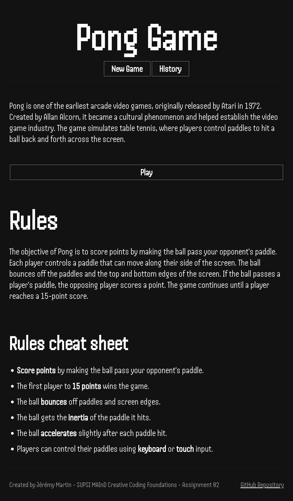
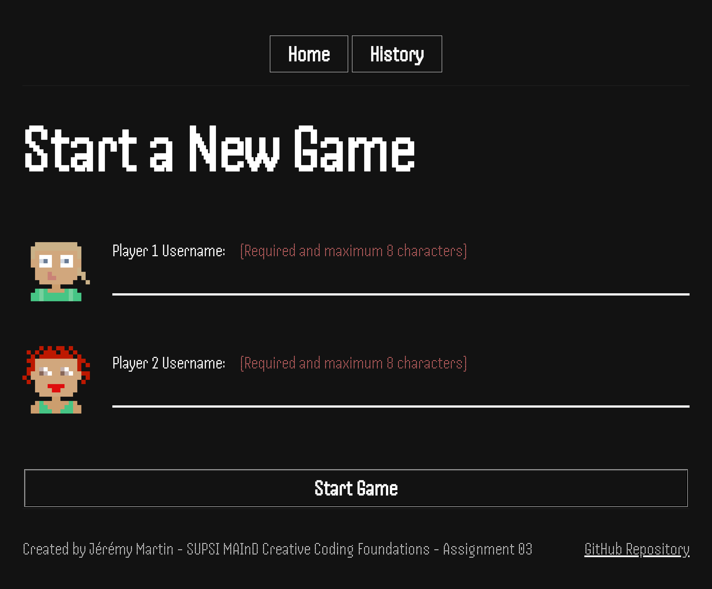
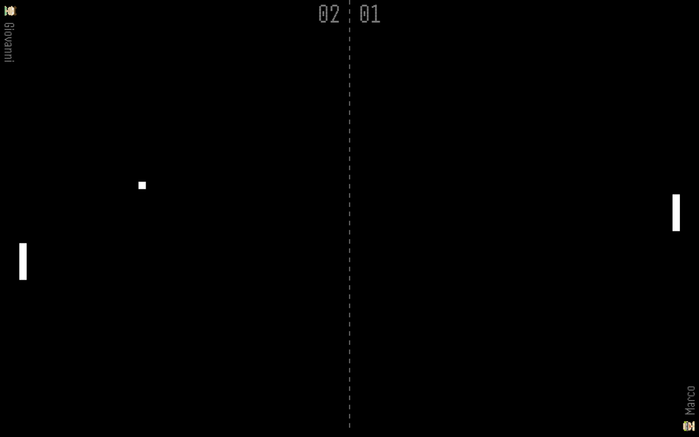
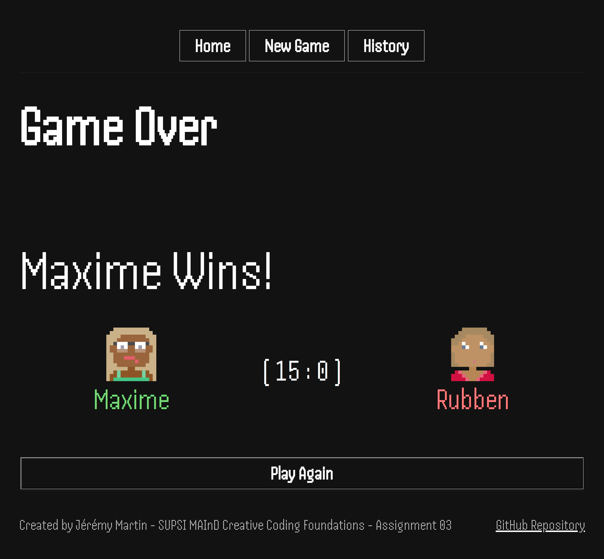
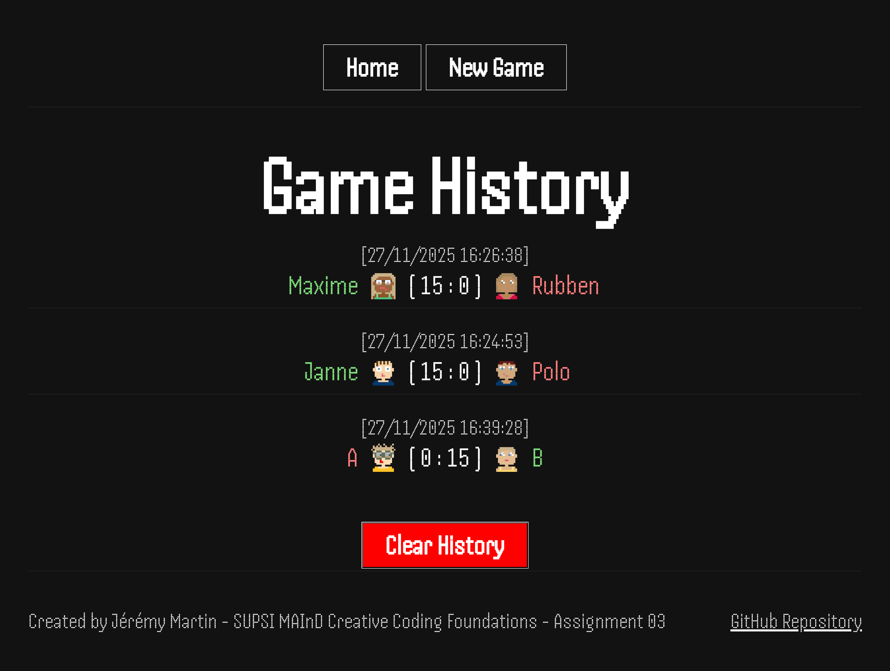
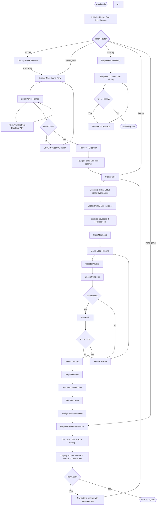
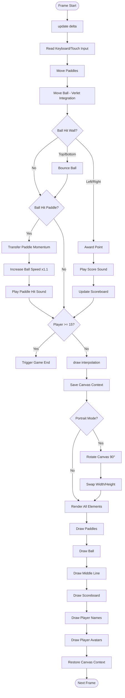

# Assignment 03
| School Information | Author |
|-------------------|--------|
| **School:** Scuola universitaria professionale della Svizzera italiana (SUPSI) | **Name:** Jérémy Martin |
| **Cursus:** MAInD Master SUPSI in Interaction Design | **Date:** 27.11.2025 |
| **Course:** 2025/26 Creative Coding Foundations | |

## Installation
Prerequisites
- Node.js 18+ and npm
- A modern browser with Canvas API support

Setup
1. Install dependencies
	```pwsh
	npm install
	```
2. Start the dev server (Vite) with hot reload at http://localhost:5173
	```pwsh
	npm run dev
	```
3. Build for production (outputs to `dist/`)
	```pwsh
	npm run build
	```
4. Preview the production build locally
	```pwsh
	npm run preview
	```

## Brief


Upgrade Assignment 02 by adding the use of data coming from an external web API. For example, fetch contents (audio, images, video, text, metadata) from online archives, AI generated contents (chatGPT API), data (weather, realtime traffic data, environmental data).

The application must have these requirements:

- The webpage should be responsive
- Choose an avatar at the beginning of the game
- Keep track of the score of the player
- Use the keyboard to control the game (indicate what are the controls in the page). You can also use buttons (mouse), but also keyboard.
- Use a web API (you choose which one best fits your project) to load the data and display them in the webpage
- At least one multimedia file (for user feedback interactions, or content itself)
- Implement an “automatic restart” in the game (that is not done via the refresh of the page)
- Develop a navigation system that allows the user to navigate different sections with related content and functionalities

## Project description

Classic Pong reimagined for modern browsers. Two players control paddles to keep the ball in play. First to 15 points wins. Features physics-based ball movement with paddle momentum transfer, progressive ball acceleration, and responsive canvas rotation for portrait mode. Supports keyboard (W/S, ArrowUp/Down) and touch controls. Game history persists locally. Designed for quick matches with Atari-style retro sound effects.

### Key Features
- **Dual input modes**: Play with keyboard (W/S for player 1, Arrow keys for player 2) or touch/click controls. Touch the screen to move your paddle.
- **Physics-based gameplay**: Ball inherits paddle momentum and accelerates slightly on each hit. Verlet integration ensures smooth, deterministic motion.
- **Responsive canvas**: Automatically rotates 90° in portrait orientation for optimal gameplay on mobile devices.
- **Game history**: All matches are saved to localStorage with player names, scores, timestamps, and winner/loser status.
- **Fullscreen mode**: Game automatically requests fullscreen on start for immersive experience. Exits fullscreen gracefully on game end.
- **Retro audio**: Atari-style sound effects for paddle hits, scoring, and game end events.
- **Score tracking**: First to 15 points wins. Real-time scoreboard displays current scores throughout the match.
- **Player avatars from API**: Choose an avatar at the beginning of the game, loaded dynamically from the DiceBear web API based on player name.

## Screenshots
### Home Screen

*Landing page with options to start a new game or view match history*

### New Game Form

*New game screen where players enter their names and are assigned an avatar based on their name before starting a match*

### Gameplay

*Active game showing paddles, ball, scoreboard, and player avatars and names*

### Game Over

*End game screen displaying the winner and match statistics*

### Game History

*Complete match history with player avatars, names, scores, and timestamps*

## Project Architecture
### Class Structure

```
PongGame (Main game controller)
├── Player (Data model)
├── Keyboard (Input manager)
├── Touchscreen (Input manager)
├── CanvasElement (Base class for positioned elements)
│   ├── Rectangle (Base paddle class)
│   │   └── RectangleBouncy (Ball class with bounce physics)
│   ├── LineDotted (Middle line renderer)
│   ├── Scoreboard (Score display)
│   ├── Text (Player name display)
│   └── Avatar (Player avatar display)
└── MainLoop (Third-party game loop)
```

### Application Flow



### Game Loop Detail



## Function List

### Classes

#### Avatar
**File:** `src/class/Avatar.js`
**Extends:** `CanvasElement`
- **Constructor:** `new Avatar({ x, y, posParam, urlEncoded, size })`
  - Creates an avatar image element with position, encoded image URL, and size
  - Supports orientation: right, left, up, down
- **draw(ctx):** Renders the avatar image on canvas with orientation-based rotation

#### CanvasElement
**File:** `src/class/CanvasElement.js`
- **Constructor:** `new CanvasElement({ x, y, posParam })`
  - Base class for canvas-positioned elements
  - posParam includes: relativeTo (9 anchor points), canvasSize
- **setPositionRelativeToCanvas(x, y, posParam):** Sets position based on canvas reference point
- **updatePositionRelativeToCanvas(dx, dy):** Updates position when canvas size changes

#### Keyboard
**File:** `src/class/Keyboard.js`
- **Constructor:** `new Keyboard()`
  - Initializes keyboard event listeners and key tracking Set
- **init():** Sets up keydown/keyup event listeners
- **isDown(keyCode):** Returns true if specified key code is currently pressed
- **destroy():** Removes all event listeners and clears key state

#### LineDotted
**File:** `src/class/LineDotted.js`
**Extends:** `CanvasElement`
- **Constructor:** `new LineDotted({ x, y, lenght, angle, posParam, color, lineWidth, dotLength, gapLength })`
  - Creates a dotted line with customizable dot/gap lengths and angle
- **draw(ctx):** Renders the dotted line segment by segment

#### Player
**File:** `src/class/Player.js`
- **Constructor:** `new Player(name)`
  - Creates a player with private name and score fields
- **getName():** Returns player's name
- **getScore():** Returns player's current score
- **incrementScore():** Increases score by 1
- **resetScore():** Resets score to 0

#### PongGame
**File:** `src/class/PongGame.js`
- **Constructor:** `new PongGame(player1, player2, mode, player1AvatarUrlEncoded, player2AvatarUrlEncoded)`
  - Initializes complete game: canvas, input handlers, paddles, ball, UI elements, MainLoop
- **start():** Starts the MainLoop
- **stop():** Stops MainLoop and destroys input handlers
- **onEnded(callback):** Sets callback for game end event
- **createPaddle(x, y, posParam):** Creates a Rectangle paddle at specified position
- **createBall(x, y):** Creates a RectangleBouncy ball with random direction
- **clearAndRefreshCanvas():** Clears canvas and updates dimensions
- **getCanvasSize():** Returns logical canvas size (swapped if portrait)
- **updateElementPosRelativeToCanvas(...elements):** Updates multiple element positions on resize
- **getPaddleKeyboardMvt():** Gets keyboard input for both paddles (orientation-aware)
- **getPaddleTouchscreenMvt():** Gets touchscreen positions for both paddles (orientation-aware)
- **applyMvtToPaddle(paddle, mvt):** Applies keyboard or touch movement to paddle
- **updatePaddlesPosition(dt, gameWidth, gameHeight):** Updates paddle physics and collision
- **updateBallsPosition(dt, gameWidth, gameHeight, balls):** Updates ball physics, collision, scoring
- **incrementPlayerScore(player):** Increments score, checks win condition, respawns ball
- **endGame():** Stops game, saves to history, plays sound, calls onEnded callback

#### Rectangle
**File:** `src/class/Rectangle.js`
**Extends:** `CanvasElement`
- **Constructor:** `new Rectangle({ x, y, width, height, mass, speed, acceleration, color, posParam })`
  - Creates rectangle with Verlet integration physics
- **distanceXto({ x }):** Returns horizontal distance to point
- **distanceYto({ y }):** Returns vertical distance to point
- **isInside({ x, y }):** Checks if point is inside rectangle
- **draw(ctx):** Renders rectangle on canvas
- **move(dt):** Updates position using Verlet integration with max speed limit
- **setSpeed(vx, vy):** Sets velocity directly
- **applySpeed(vx, vy):** Adds velocity to current velocity
- **getSpeed():** Returns current velocity as {x, y}
- **setForce(fx, fy, divider):** Sets acceleration
- **applyForce(fx, fy, divider):** Adds to acceleration
- **stop():** Stops all movement and acceleration
- **canvasCollision(canvasWidth, canvasHeight):** Keeps rectangle within canvas bounds

#### RectangleBouncy
**File:** `src/class/RectangleBouncy.js`
**Extends:** `Rectangle`
- **Constructor:** `new RectangleBouncy({ x, y, width, height, speed, acceleration, color })`
  - Extends Rectangle with bounce physics
- **canvasCollision(canvasWidth, canvasHeight, bounce):** Bounces off walls, returns side hit ('left'/'right'/'top'/'bottom')
- **rectangleCollision(Rectangle, bounce):** Bounces off paddle, transfers momentum, plays sound

#### Scoreboard
**File:** `src/class/Scoreboard.js`
**Extends:** `CanvasElement`
- **Constructor:** `new Scoreboard({ x, y, posParam, font, color, gap, scores })`
  - Creates two-player scoreboard with gap between scores
- **updateSideScore(side, newScore):** Updates 'left' or 'right' score
- **updateScore(leftScore, rightScore):** Updates both scores
- **draw(ctx):** Renders scores with leading zeros, centered horizontally

#### Text
**File:** `src/class/Text.js`
**Extends:** `CanvasElement`
- **Constructor:** `new Text({ x, y, posParam, font, color, text })`
  - Creates text element with orientation support (right/left/up/down)
- **draw(ctx):** Renders text with alignment and rotation based on orientation

#### Touchscreen
**File:** `src/class/Touchscreen.js`
- **Constructor:** `new Touchscreen()`
  - Initializes touch/gesture event listeners, prevents zoom gestures
- **init():** Sets up touchstart/touchmove/touchend/touchcancel event listeners
- **destroy():** Removes all event listeners (touch, gesture, wheel) and clears touch Map

### Utility Functions

#### Audio (`src/utils/audio.js`)
- **playOnce(audio, callback):** Internal helper to play audio from start with optional callback
- **playButtonSound(callback):** Plays button click sound
- **playPaddleHitSound(callback):** Plays paddle hit sound
- **playWinPointSound(callback):** Plays point win sound
- **playLosePointSound(callback):** Plays point loss sound
- **playWinSound(callback):** Plays game win sound
- **playLoseSound(callback):** Plays game loss sound
- **initializeButtonSounds():** Attaches click sounds to all button elements

#### Avatar (`src/utils/avatar.js`)
- **getAvatarUrl(seed):** Generates DiceBear API URL for given seed
- **getAvatarUrlEncoded(username):** Fetches SVG avatar and returns as URI-encoded data URI

#### History Manager (`src/utils/historyManager.js`)
- **initializeHistory():** Loads game history from localStorage into Map
- **getHistory():** Returns all game records as array (reversed, newest first)
- **getLatestGame():** Returns most recent game or null
- **saveHistory():** Persists history Map to localStorage
- **clearHistory():** Removes all history and saves empty state
- **addGameResultToHistory(player1Avatar, player1Name, player1Score, player2Avatar, player2Name, player2Score, mode):** Adds timestamped game record with validation

#### LocalStorage (`src/utils/localStorage.js`)
- **getLocalStorageItem(key):** Retrieves and parses JSON from localStorage
- **setLocalStorageItem(key, value):** Stringifies and saves value to localStorage

#### Navigation (`src/utils/navigation.js`)
- **displaySection(id):** Shows section with matching ID, hides all others
- **getQueryParamsFromHash():** Parses query parameters from URL hash

#### Screen (`src/utils/screen.js`)
- **getScreenOrientation():** Returns 'landscape' or 'portrait' based on viewport dimensions
- Window resize listener updates orientation automatically

### Section Controllers

#### End Game (`src/section/endGame.js`)
- **displayEndGame():** Fetches latest game, displays winner, scores, avatars, usernames with styling
- Play Again button event listener: navigates to game with same players

#### Game (`src/section/game.js`)
- **displayGame(player1Name, player2Name, mode):** Creates players, fetches avatars, initializes PongGame, sets up end handler

#### History (`src/section/history.js`)
- **displayHistory():** Renders all game history as list items with dates, avatars, scores, winner/loser styling
- Clear History button event listener: clears history and refreshes display

#### New Game (`src/section/newGame.js`)
- **displayNewGame():** Resets form fields and avatars to defaults
- Form input event listener: updates avatar previews in real-time
- Form submit event listener: validates inputs, requests fullscreen, navigates to game with parameters

### Main Application (`src/index.js`)
- **initializeHistory():** Called on load to populate history from localStorage
- **audio.initializeButtonSounds():** Sets up button sound effects
- **router():** Hash-based router that parses URL and displays appropriate section with data
  - Routes: #home, #new-game, #history, #game?params, #end-game
- Window hashchange event listener: triggers router on navigation


## Known Limitations
- Game mode selection is currently commented out (only "Single Player" mode available, but plays as two-player)

## Content and Data Sources

### Audio Assets
All sound effects are sourced from classic Atari arcade games, providing authentic retro gaming atmosphere:
- **atari-button.mp3** - Button click sound effect
- **atari-paddle-hit.mp3** - Paddle collision sound effect
- **atari-win-point.mp3** - Point scoring sound effect
- **atari-lose-point.mp3** - Point loss sound effect
- **atari-win.mp3** - Game victory sound effect
- **atari-lose.mp3** - Game defeat sound effect

Location: `src/assets/`

### Fonts
- **Handjet** - Variable width sans-serif font from Google Fonts, used for all game UI text elements including scores, player names, and UI labels

### Player Avatars
Player avatars are dynamically generated using the **DiceBear API** (Pixel Art style). Each avatar is:
- Generated server-side based on the player's username as a seed
- Returned as SVG format for scalability
- URI-encoded and embedded as data URIs for canvas rendering
- Cached during game session for performance

## API Documentation

### DiceBear Avatar API
**Base URL:** `https://api.dicebear.com/9.x/pixel-art/svg`

**Purpose:** Generate unique, deterministic pixel-art style avatars for players

**Usage in Application:**
- **Endpoint:** `GET https://api.dicebear.com/9.x/pixel-art/svg?seed={username}`
- **Parameters:**
  - `seed` (string, required): Player username used to generate consistent avatar
- **Response:** SVG image (text/xml)
- **Implementation:** `src/utils/avatar.js`
  - `getAvatarUrl(seed)` - Constructs API URL
  - `getAvatarUrlEncoded(username)` - Fetches SVG and encodes as data URI

**Features:**
- Deterministic generation: Same username always produces same avatar
- No authentication required
- Free tier suitable for this application
- SVG format allows scaling without quality loss

**Integration Points:**
1. New Game form: Real-time avatar preview on username input
2. Game screen: Player avatars displayed during gameplay
3. End Game screen: Winner/loser avatars with results
4. History screen: Avatars shown for all past games

**Error Handling:**
- Validates username is not empty before API call
- Falls back to default "Player 1"/"Player 2" avatars if fetch fails
- Uses URI encoding to safely handle special characters in usernames

## Credits
- MainLoop.js by Isaac Sukin (MIT License) - [GitHub Repository](https://github.com/IceCreamYou/MainLoop.js)
- Atari sound effects from classic arcade games
- Handjet font from Google Fonts
- DiceBear Avatar API - [https://www.dicebear.com/](https://www.dicebear.com/)
