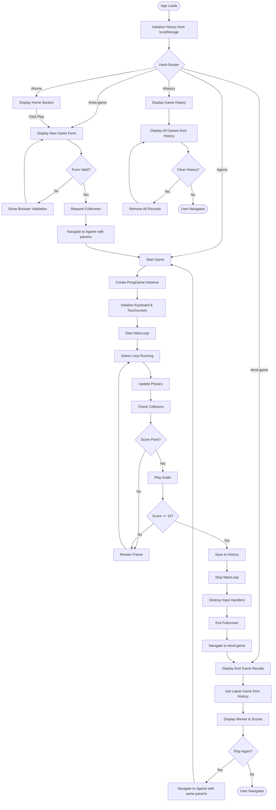
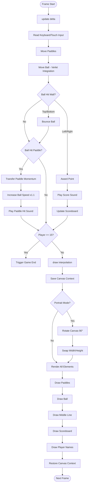

# Assignment 02
| School Information | Author |
|-------------------|--------|
| **School:** Scuola universitaria professionale della Svizzera italiana (SUPSI) | **Name:** Jérémy Martin |
| **Cursus:** MAInD Master SUPSI in Interaction Design | **Date:** 20.11.2025 |
| **Course:** 2025/26 Creative Coding Foundations | |

## Installation
Prerequisites
- Node.js 18+ and npm
- A modern browser with Canvas API support

Setup
1. Install dependencies
	```pwsh
	npm install
	```
2. Start the dev server (Vite) with hot reload at http://localhost:5173
	```pwsh
	npm run dev
	```
3. Build for production (outputs to `dist/`)
	```pwsh
	npm run build
	```
4. Preview the production build locally
	```pwsh
	npm run preview
	```

## Brief

Choose a “mini-game” to rebuild with HTML, CSS and JavaScript. The requirements are:

- The webpage should be responsive
- Choose an avatar at the beginning of the game
- Keep track of the score of the player
- Use the keyboard to control the game (indicate what are the controls in the page). You can also use buttons (mouse), but also keyboard.
- Use some multimedia files (audio, video, …)
- Implement an “automatic restart” in the game (that is not done via the refresh of the page)

## Project description
Classic Pong reimagined for modern browsers. Two players control paddles to keep the ball in play. First to 15 points wins. Features physics-based ball movement with paddle momentum transfer, progressive ball acceleration, and responsive canvas rotation for portrait mode. Supports keyboard (W/S, ArrowUp/Down) and touch controls. Game history persists locally. Designed for quick matches with Atari-style retro sound effects.

### Key Features
- **Dual input modes**: Play with keyboard (W/S for player 1, Arrow keys for player 2) or touch/click controls. Touch the screen to move your paddle.
- **Physics-based gameplay**: Ball inherits paddle momentum and accelerates slightly on each hit. Verlet integration ensures smooth, deterministic motion.
- **Responsive canvas**: Automatically rotates 90° in portrait orientation for optimal gameplay on mobile devices.
- **Game history**: All matches are saved to localStorage with player names, scores, timestamps, and winner/loser status.
- **Fullscreen mode**: Game automatically requests fullscreen on start for immersive experience. Exits fullscreen gracefully on game end.
- **Retro audio**: Atari-style sound effects for paddle hits, scoring, and game end events.
- **Score tracking**: First to 15 points wins. Real-time scoreboard displays current scores throughout the match.

## Screenshots
### Home Screen

*Landing page with options to start a new game or view match history*

### Main Menu

*New game screen where players enter their names before starting a match*

### Gameplay

*Active game showing paddles, ball, scoreboard, and player names*

### Game Over

*End game screen displaying the winner and match statistics*

### Game History

*Complete match history with player names, scores, and timestamps*

## Project Architecture
### Class Structure

```
PongGame (Main game controller)
├── Player (Data model)
├── Keyboard (Input manager)
├── Touchscreen (Input manager)
├── CanvasElement (Base class for positioned elements)
│   ├── Rectangle (Base paddle class)
│   │   └── RectangleBouncy (Ball class with bounce physics)
│   ├── LineDotted (Middle line renderer)
│   ├── Scoreboard (Score display)
│   └── Text (Player name display)
└── MainLoop (Third-party game loop)
```

### Application Flow



### Game Loop Detail



## Function List

### Core Game Classes

#### PongGame (`src/class/PongGame.js`)
| Function | Arguments | Description | Returns |
|----------|-----------|-------------|---------|
| `constructor()` | `player1: Player`, `player2: Player`, `mode: string` | Creates game instance, initializes canvas, input handlers, and game objects | `PongGame` |
| `start()` | None | Starts the MainLoop and begins game execution | `void` |
| `stop()` | None | Stops MainLoop and destroys input handlers (keyboard, touchscreen) | `void` |
| `onEnded()` | `callback: Function` | Registers callback to execute when game ends | `void` |
| `createPaddle()` | `x: number`, `y: number`, `options: Object` | Creates a Rectangle paddle with position and options | `Rectangle` |
| `createBall()` | `x: number`, `y: number` | Creates a RectangleBouncy ball at specified position | `RectangleBouncy` |
| `getCanvasSize()` | None | Returns current canvas dimensions, swapped if portrait mode | `{width: number, height: number}` |

#### Player (`src/class/Player.js`)
| Function | Arguments | Description | Returns |
|----------|-----------|-------------|---------|
| `constructor()` | `name: string`, `score?: number` | Creates player with name and optional initial score | `Player` |
| `getName()` | None | Returns player's name | `string` |
| `getScore()` | None | Returns player's current score | `number` |
| `incrementScore()` | None | Increases score by 1 | `void` |

#### Rectangle (`src/class/Rectangle.js`)
| Function | Arguments | Description | Returns |
|----------|-----------|-------------|---------|
| `constructor()` | `options: Object` | Creates rectangle with position, size, color, mass, and positioning params | `Rectangle` |
| `draw()` | `ctx: CanvasRenderingContext2D` | Renders rectangle on canvas | `void` |
| `move()` | None | Updates position using Verlet integration | `void` |
| `stop()` | None | Stops all movement by zeroing velocity | `void` |
| `setSpeed()` | `speed: number`, `angle: number` | Sets velocity in direction of angle | `void` |
| `applyForce()` | `forceX: number`, `forceY: number` | Applies force to object considering mass | `void` |
| `canvasCollision()` | `canvasSize: Object` | Checks and handles collisions with canvas boundaries | `'top' \| 'bottom' \| 'left' \| 'right' \| null` |

#### RectangleBouncy (`src/class/RectangleBouncy.js`)
| Function | Arguments | Description | Returns |
|----------|-----------|-------------|---------|
| `constructor()` | `options: Object` | Creates bouncy rectangle (ball) with bounce coefficient | `RectangleBouncy` |
| `canvasCollision()` | `canvasSize: Object` | Handles wall collisions with bouncing and returns which wall was hit | `'top' \| 'bottom' \| 'left' \| 'right' \| null` |
| `rectangleCollision()` | `rectangle: Rectangle` | Detects and resolves collision with another rectangle (paddle) | `boolean` |

#### CanvasElement (`src/class/CanvasElement.js`)
| Function | Arguments | Description | Returns |
|----------|-----------|-------------|---------|
| `constructor()` | `options: Object` | Creates positioned canvas element with x, y coordinates | `CanvasElement` |
| `setPositionRelativeToCanvas()` | `options: Object` | Sets position relative to canvas reference point (9 positions) | `void` |
| `updatePositionRelativeToCanvas()` | `canvasSize: Object` | Updates position when canvas size changes | `void` |

#### Keyboard (`src/class/Keyboard.js`)
| Function | Arguments | Description | Returns |
|----------|-----------|-------------|---------|
| `constructor()` | None | Initializes keyboard event listeners | `Keyboard` |
| `isDown()` | `keyCode: string` | Checks if specified key is currently pressed | `boolean` |
| `destroy()` | None | Removes all keyboard event listeners | `void` |

#### Touchscreen (`src/class/Touchscreen.js`)
| Function | Arguments | Description | Returns |
|----------|-----------|-------------|---------|
| `constructor()` | None | Initializes touch event listeners and gesture prevention | `Touchscreen` |
| `destroy()` | None | Removes all touch and gesture event listeners | `void` |

### UI Rendering Classes

#### LineDotted (`src/class/LineDotted.js`)
| Function | Arguments | Description | Returns |
|----------|-----------|-------------|---------|
| `constructor()` | `options: Object` | Creates dotted line with length, angle, color, dot/gap lengths | `LineDotted` |
| `draw()` | `ctx: CanvasRenderingContext2D` | Renders dotted line on canvas | `void` |

#### Scoreboard (`src/class/Scoreboard.js`)
| Function | Arguments | Description | Returns |
|----------|-----------|-------------|---------|
| `constructor()` | `options: Object` | Creates scoreboard with font, color, and gap between scores | `Scoreboard` |
| `draw()` | `ctx: CanvasRenderingContext2D`, `score1: number`, `score2: number` | Renders both scores centered on canvas | `void` |

#### Text (`src/class/Text.js`)
| Function | Arguments | Description | Returns |
|----------|-----------|-------------|---------|
| `constructor()` | `options: Object` | Creates text element with font, color, text content, and rotation | `Text` |
| `draw()` | `ctx: CanvasRenderingContext2D` | Renders text with optional rotation | `void` |
| `setText()` | `text: string` | Updates displayed text | `void` |

### Section Display Functions

#### Navigation (`src/utils/navigation.js`)
| Function | Arguments | Description | Returns |
|----------|-----------|-------------|---------|
| `displaySection()` | `id: string` | Shows section with given ID, hides others | `void` |
| `getQueryParamsFromHash()` | None | Parses query parameters from URL hash | `URLSearchParams` |

#### Game Section (`src/section/game.js`)
| Function | Arguments | Description | Returns |
|----------|-----------|-------------|---------|
| `displayGame()` | `player1Name?: string`, `player2Name?: string`, `mode?: string` | Creates PongGame instance and starts gameplay | `void` |

#### New Game Section (`src/section/newGame.js`)
| Function | Arguments | Description | Returns |
|----------|-----------|-------------|---------|
| `displayNewGame()` | None | Resets new game form to default state | `void` |

#### End Game Section (`src/section/endGame.js`)
| Function | Arguments | Description | Returns |
|----------|-----------|-------------|---------|
| `displayEndGame()` | None | Displays latest game results with winner and scores | `void` |

#### History Section (`src/section/history.js`)
| Function | Arguments | Description | Returns |
|----------|-----------|-------------|---------|
| `displayHistory()` | None | Renders list of all game records from localStorage | `void` |

### Utility Functions

#### History Manager (`src/utils/historyManager.js`)
| Function | Arguments | Description | Returns |
|----------|-----------|-------------|---------|
| `initializeHistory()` | None | Loads game history from localStorage into memory Map | `void` |
| `addGameResultToHistory()` | `player1Name: string`, `player1Score: number`, `player2Name: string`, `player2Score: number`, `mode: string` | Creates timestamped game record and saves to localStorage | `void` |
| `getHistory()` | None | Returns all game records as array | `GameRecord[]` |
| `getLatestGame()` | None | Returns most recent game or null | `GameRecord \| null` |
| `clearHistory()` | None | Removes all game records | `void` |
| `saveHistory()` | None | Persists history Map to localStorage | `void` |

#### LocalStorage (`src/utils/localStorage.js`)
| Function | Arguments | Description | Returns |
|----------|-----------|-------------|---------|
| `getLocalStorageItem()` | `key: string` | Retrieves and parses JSON value from localStorage | `any \| null` |
| `setLocalStorageItem()` | `key: string`, `value: any` | Stores value as JSON in localStorage | `void` |

#### Audio (`src/utils/audio.js`)
| Function | Arguments | Description | Returns |
|----------|-----------|-------------|---------|
| `playButtonSound()` | `callback?: Function` | Plays button click sound | `void` |
| `playPaddleHitSound()` | `callback?: Function` | Plays paddle hit sound | `void` |
| `playWinPointSound()` | `callback?: Function` | Plays win point sound | `void` |
| `playLosePointSound()` | `callback?: Function` | Plays lose point sound | `void` |
| `playWinSound()` | `callback?: Function` | Plays game win sound | `void` |
| `playLoseSound()` | `callback?: Function` | Plays game lose sound | `void` |

#### Screen (`src/utils/screen.js`)
| Function | Arguments | Description | Returns |
|----------|-----------|-------------|---------|
| `getScreenOrientation()` | None | Returns current screen orientation ('landscape' or 'portrait') | `string` |

### Router (`src/index.js`)
| Function | Arguments | Description | Returns |
|----------|-----------|-------------|---------|
| `router()` | None | Handles hash changes and displays appropriate section | `void` |

## Known Limitations
- Game mode selection is currently commented out (only "Single Player" mode available, but plays as two-player)

## Credits
- MainLoop.js by Isaac Sukin (MIT License) - [GitHub Repository](https://github.com/IceCreamYou/MainLoop.js)
- Atari sound effects from classic arcade games
- Handjet font from Google Fonts
